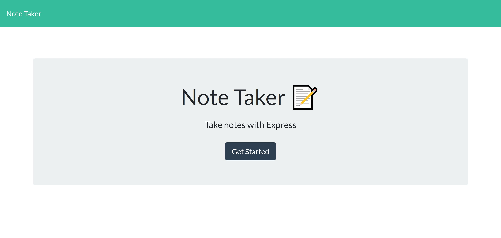
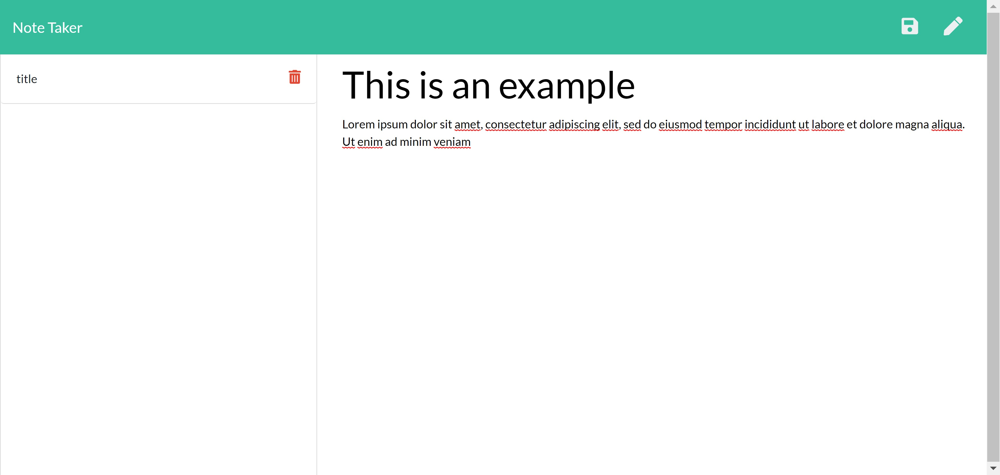
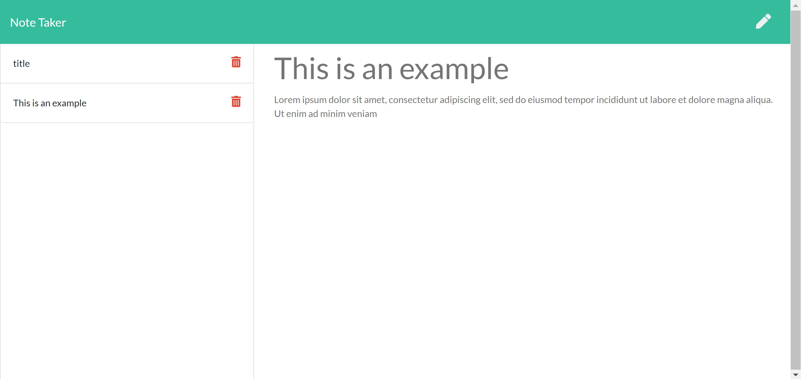

# JSON Note-Taker
## Description
This is my JSON note-taker application. It utilizes express, uuid for generated IDs, fs to connect to file server, and path for referencing other html/js pages.

### Screenshots

- - - - - - - - - - - - - - - - - -

## Table of Contents
- [Installation](#installation)
- [Usage](#usage)
- [License](#license)
- [Contributing](#contributing)

- - - - - - - - - - - - - - - - - -

## Installation
Ensure that you have node.js installed on your device. Run npm i to install json files.

## Usage
To create a note, proceed to the notes page by clicking the button, type in your note, and hit the save button in the top right corner. You can revisit a note by clicking on the text on the left hand side and you can create a new note by clicking on the pencil icon on the top right next to the save button.

## Contributing
Github: scwithington
  